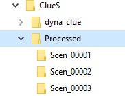
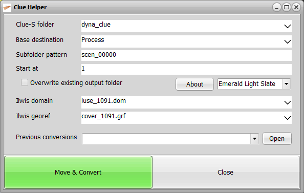

# Clue helper manual
September 2020

## Introduction
This software has been developed as a complementary software to the Clue-S modelling software (version 2.0, 2006).
The helper software is added to manage the modelling output of the Clue-S software. The advantages:
- It automatically starts the Clue-S modelling software or if already running activates it.
- Organizes the output of the modelling in separate folders, one for each scenario output
- Enables quickly running multiple scenarios, but clearing the last modelling output
- Converts the modelling output to ILWIS format files as well.
- Quick access to the output of previous runs

## Installation
The helper software is a single windows executable file. It expects to be installed in a parent folder of the Clue-S software. Typical directory structure:

 
The Clue helper software is installed (copied) into the ClueS folder. The modelling software Clue-S is located in a subfolder, in this case _dyna_clue_.
A second subfolder, in this case _Processed_, stores the modelling output for each scenario.

## Workflow
A normal workflow starts with setting up the model parameters and then running the model. This will generate output files in the Clue-S folder.
Running a different scenario will normally overwrite these outputs, unless the output is moved to a save place. This is where the Clue helper steps in after a successful run of the modelling. Click the Convert & Move button will let the Clue helper automatically create a new folder (in this example in the Processed folder, see the directory structure), move the outputs to this new folder and also convert these to ILWIS format files.
The outputs are now safe and a new modelling scenario can be started. Note the output names themselves are not changed.

## User Interface

 
The elements in the user interface:

|Entry|Description|
|:-----|:-----------|
|Clue-S folder|The folder where the modelling software is stored; this folder also contains the ILWIS domain and georeferenced service objects that match the model dimensions and values. The small down arrow opens a menu from which the folder can be selected. Note the existence of an additional file called *cov_all.0.Copy*: this file is used as a template to recreate *cov_all.0* after each model run.|
|Base destination|This is the folder where all the modelling outputs will be stored in a subfolder for each scenario. The small down arrow opens a menu from which the folder can be selected.

**New folder**  You can create a new folder for this entry in two ways: 1. Type the name of the new folder, then click on the down arrow and select `<new>`. The folder is created and selected. 2. Add a new folder in the windows explorer. The new folder is added in the menu under the down arrow immediately and you can select it. In both cases the Start at entry is set to 1.|
|Subfolder pattern|Define the pattern for the scenario subfolders. The pattern begins with a text part followed by a sequence of zeros. The text part will be taken as-is. The number of zeroes determines the number of digits ending up in the folder name. If no zeroes are included this number defaults to 5. For example, the pattern scen_000 will result in folder names: scen_001, scen_002, etc.|
|Start at|This sequence number is combined with the subfolder pattern and defines at what number the subfolder number part will start. At each start of the program this is calculated from the already existing scenario folders. For example, if the folders scen_00001, scen_00002 and scen_00003 already exist the start number will be set at 4.|
|Overwrite existing output folder|Allows the helper to overwrite output in the current subfolder if there are already outputs from a previous run. This might be handy if for one reason or another the outputs in a certain folder are invalid or not useful.|
|Ilwis domain|An Ilwis (class) domain file matching the values in the model outputs. This file be copied to the output folder as it is linked to the Ilwis conversion output files. The small down arrow opens a menu from which an appropriate domain can be selected (only if the Clue-S folder has been specified).|
|Ilwis georef|An Ilwis georeferenced file matching the dimension of the model outputs. This file be copied to the output folder as it is linked to the Ilwis conversion output files. The small down arrow opens a menu from which an appropriate georeference can be selected (only if the Clue-S folder has been specified).|
|Previous conversions|The helper keeps a list of the previous executed scenarios that match the subfolder pattern. It is also reloaded during startup|
|Open|When a previous scenario is selected in the previous conversions selection, clicking this button will open an explorer window in the selected folder.|
|Move & Convert|Move the current output files to the next scenario folder and convert to ILWIS files. Increase the sequence number. During the copy and conversion, the button turns into a progress indicator.|
|Close|Close the Clue helper.|
|About|Pops up a small window with program info|
|Theme selection|Defaults to Emerald Light Slate. Change the GUI theme|

Note that the About and Theme selection options don't affect the operation of the Clue helper.
Any changes in the GUI entries are saved in a config file and will be restored when the Clue helper is started again. This includes size and position.

